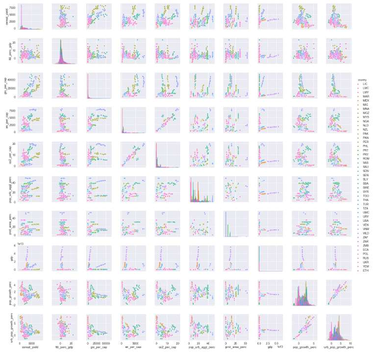
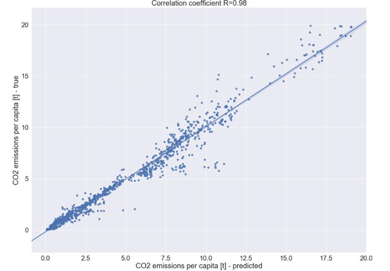
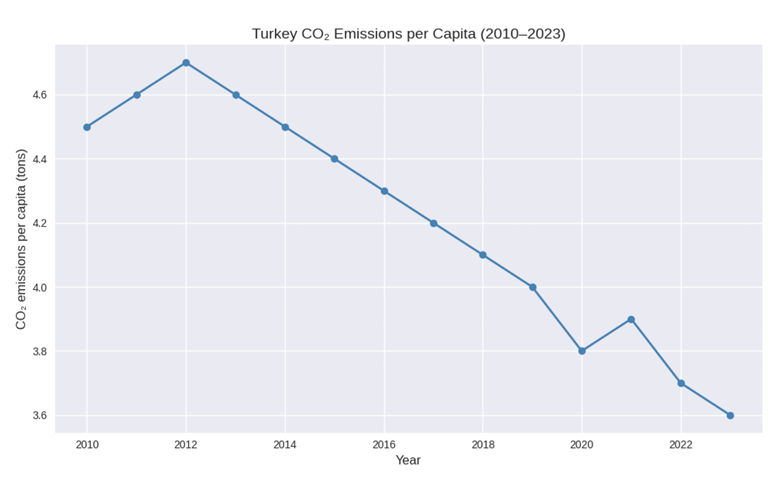
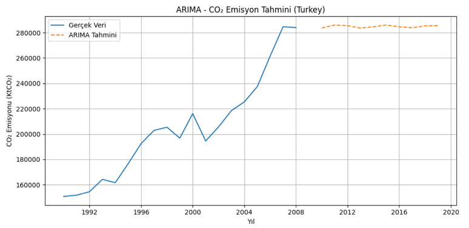
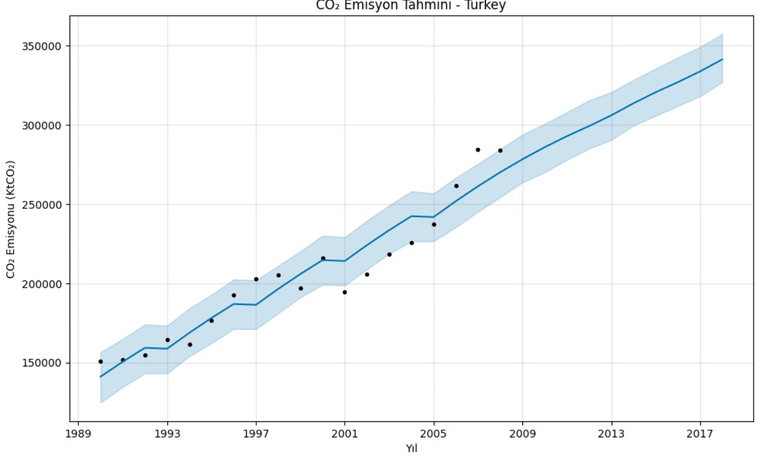
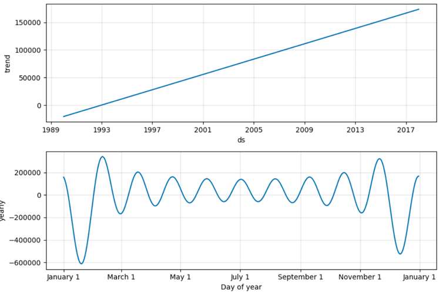

#  Sustainable Development Planning with Machine Learning  
## Multi-Country CO₂ Emission Prediction Model and the Case of Turkey

This project focuses on **machine learning–based CO₂ emission prediction models** developed using **multi-country datasets**, within the scope of the **United Nations Sustainable Development Goals (SDG 13 – Climate Action)**.

The study analyzes both **per capita CO₂ emissions across countries** and **Turkey’s total CO₂ emission trends** using regression and time-series forecasting methods.

---

##  Project Objectives

- Predict **per capita CO₂ emissions** using multi-country historical data  
- Model complex relationships between socio-economic variables using **Random Forest Regression**  
- Analyze results with a **focus on Turkey**  
- Examine **Turkey’s total CO₂ emission trends** using **ARIMA and Prophet** time-series models  
- Provide **data-driven policy insights** aligned with **SDG 13**

---

##  Dataset and Sources

### Main Dataset
- **Source:** Our World in Data (OWID) – CO₂ Dataset  
- **Years:** 2010 – 2023  
- **Scope:** Annual observations from multiple countries  

### Additional Dataset (Time Series Analysis)
- **Source:** World Bank  
- **File:** `climate_change_download_0.csv`  
- **Scope:** Turkey’s total CO₂ emissions (2008–2020)

---

##  Variables Used

### Dependent Variable
- `co2_per_cap` – CO₂ emissions per capita (tons)

### Independent Variables
- `en_per_cap` – Energy consumption per capita  
- `gni_per_cap` – Gross National Income per capita  
- `cereal_yield` – Cereal yield  
- `pop_urb_aggl_perc` – Urban agglomeration percentage  
- `urb_pop_growth_perc` – Urban population growth rate  

---

##  Methodology

### 1️⃣ Data Preprocessing & Exploratory Analysis
- Pearson correlation matrix  
- Pairplot visualizations  
- Outlier detection and removal (e.g., United Arab Emirates)

### 2️⃣ Machine Learning Model
- **Model:** Random Forest Regressor  
- **Train/Test Split:** 80% / 20%  

### 3️⃣ Evaluation Metrics
- R² Score  
- Mean Squared Error (MSE)  
- Root Mean Squared Error (RMSE)

---

##  Results and Visualizations

### 🔹 Variable Relationships
Correlation analysis shows that **energy consumption per capita** is the most influential factor affecting CO₂ emissions.

---

### 🔹 Model Performance (Random Forest)

- **R²:** 0.968  
- **RMSE:** ≈ 0.78 tons  

The model explains approximately **96.8% of the variance** in per capita CO₂ emissions.

---

### 🇹🇷 Turkey Case – Per Capita Emissions
- 2010: ~4.5 tons/person  
- 2023: ~3.6 tons/person  
- Overall trend: **Decreasing**

---

##  Additional Analysis: Turkey’s Total CO₂ Emissions (Time Series)

Turkey’s total CO₂ emissions were analyzed using **ARIMA** and **Prophet** models.

### 🔹 ARIMA Forecast

### 🔹 Prophet Trend Analysis

### 🔹 Prophet Components

 **Key Findings:**
- Prophet model achieved **R² = 0.9096**
- While per capita emissions show a decreasing trend, **total emissions continue to increase**
- Population growth and industrialization are major contributing factors

---

##  Conclusions and Policy Implications (SDG 13)

### Conclusions
- Random Forest achieved high predictive accuracy  
- Energy consumption and economic indicators strongly influence CO₂ emissions  
- Turkey shows efficiency improvements, but **absolute emission reduction has not yet been achieved**

### Policy Recommendations
1. Strengthening **energy efficiency regulations**  
2. Promoting **renewable energy investments**  
3. Implementing **green growth (decoupling) strategies**  
4. Supporting **sustainable urbanization and transportation policies**

---

##  Technologies Used
- Python  
- Pandas, NumPy  
- Scikit-learn  
- Matplotlib, Seaborn  
- Prophet, Statsmodels (ARIMA)

---

## 📄 Note
This project was developed for **academic purposes**.
